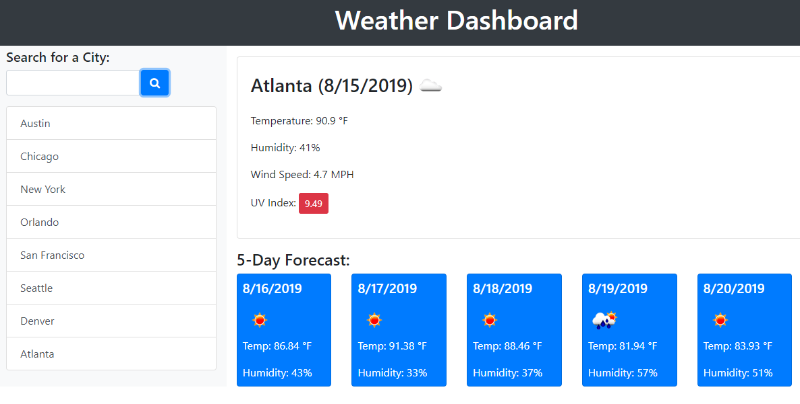

# WeatherDashboard
A weather dashboard that display live weather updates streaming from https://openweathermap.org/api

## Introduction
This is a weather dashboard application with search functionality to find current weather conditions and the future weather outlook for multiple cities. This app will run in the browser and feature dynamically updated HTML and CSS powered by jQuery. AJAX is also present in the code to hook into the API to retrieve data in JSON format.

## Usage
As a traveler
I want to see the weather outlook for multiple cities
so that I can plan a trip accordingly

